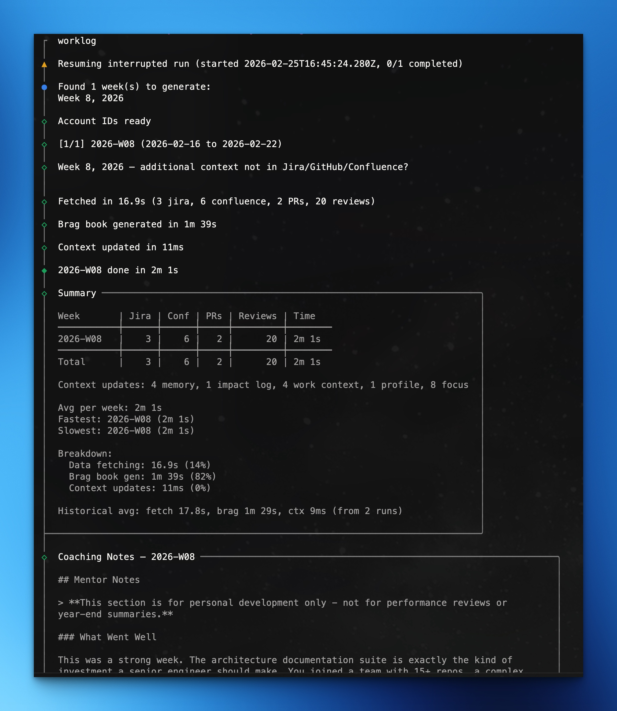

# worklog

A weekly 5-minute habit that turns your Jira/GitHub/Confluence activity into a brag book with career coaching.

## Why

You should be judged on your performance, not your writing skills or your memory. But that's exactly what happens when review time comes and you're staring at a blank self-review trying to reconstruct six months of work.

worklog makes sure neither your memory nor your writing get in the way of showing the great work you actually did. It's a weekly ritual — every Friday you run it, it pulls your Jira tickets, GitHub PRs, and Confluence pages, asks you what else happened, and turns all of that into a brag book entry with coaching feedback.

5 minutes a week. That's the whole commitment. Schedule it, do it, move on. Your brag book builds itself week by week.

You *can* generate retroactively for past weeks — and it works fine for that. But the real value comes from the weekly habit, when the details are still fresh and you can add the context that matters.

## What it does

- Pulls your Jira tickets, GitHub PRs, and Confluence pages each week
- Generates a brag book entry with coaching feedback
- Generates prep docs for 1:1s, self-reviews, promotion cases, and resume bullets
- Everything stays local in a markdown vault on your machine

## Quick start

Requires [Bun](https://bun.sh) v1.x+.

```bash
# If using npm global install, ensure this is in ~/.npmrc
echo "@contentful-labs:registry=https://npm.pkg.github.com" >> ~/.npmrc

# Install
npm install -g @contentful-labs/worklog   # or: bun install -g @contentful-labs/worklog

# Setup and first run
worklog init          # guided setup -- creates config + vault docs
worklog               # generate your first brag book
```

That's your first entry done. From here, the workflow is: run `worklog` each Friday, add context when prompted, and you're done for the week.

<details>
<summary>Install from source</summary>

```bash
git clone https://github.com/contentful-labs/worklog.git
cd worklog
bun install
bun link              # puts `worklog` and `wl` in your PATH
```
</details>

When performance review time comes around, run one command:

```bash
worklog prep self-review
```

It reads your brag book history and drafts a self-review. If there are weeks you skipped, it walks through them first — pulling your activity and generating the missing entries before writing the review.



## Commands

```
worklog                    Generate weekly brag book(s)
worklog refresh            Pick up what has changed since the last run
worklog prep 1on1          1:1 meeting prep
worklog prep self-review   Self-review draft
worklog prep promotion     Promotion case
worklog prep skip-level    Skip-level meeting prep
worklog prep resume        Resume bullet points
worklog init               First-time setup
worklog configure          Update settings
```

Short aliases: `wl` for `worklog`, `prep` for `worklog prep`.

### `worklog`

Generate brag books for missing weeks.

```bash
worklog                    # fill gaps from earliest existing brag book
worklog --weeks 4          # last 4 weeks
worklog --week 2026-W07    # specific week
worklog --force            # regenerate even if exists
worklog --since 2025-01-01 # from date to now
```

### `worklog refresh`

Go back over weeks you have already written and pick up what has happened since.

```bash
worklog refresh                    # every week since your current team started
worklog refresh --since 2026-01-01 # from a date
worklog refresh --week 2026-W07    # one week
worklog refresh --source jira      # one source
```

Each change is filed in the week it happened, not the week you ran the command: a
comment written this week lands in this week even when the ticket is from August. Only
the weeks whose activity actually changed are written again, so a run that finds
nothing makes no AI call and touches no file. When a week does need writing again, its
existing brag book goes back to the model along with only the new material, and the
instruction is to add to the entry rather than replace it.

The table at the end shows what each source contributed per week and how long it took.

### `worklog prep <type>`

Generate prep documents from brag book history:

```bash
worklog prep 1on1          # 1:1 meeting prep (default: 4 weeks)
worklog prep self-review   # performance self-review (default: 12 weeks)
worklog prep skip-level    # skip-level meeting prep (default: 4 weeks)
worklog prep promotion     # promotion case (default: 26 weeks)
worklog prep resume        # resume bullet points (default: 26 weeks)
```

Options: `--weeks N`, `--since YYYY-MM-DD`, `--until YYYY-MM-DD`, `--extended`

### `worklog init`

Guided first-run setup. Connects your APIs, creates your profile, and sets up career context and coaching preferences.

### `worklog configure [section]`

Update any part of your configuration:

```bash
worklog configure          # pick a section interactively
worklog configure ai       # change authentication method or model
worklog configure profile  # update your profile details
worklog configure career   # update career context
worklog configure vault    # change output directory
worklog configure atlassian
worklog configure github
worklog configure team-history
worklog configure coaching
```

## How it works

1. Fetches your week's activity from Jira, Confluence, and GitHub into an event ledger
2. Asks you what else happened — decisions, conversations, context the tools couldn't capture
3. Writes a structured markdown work log from all of that
4. Reads the work log + your context docs and generates a brag book with achievements and a coaching session
5. Updates your running docs: memory (small contributions), impact log (big wins), and focus tracking (week-over-week accountability)

All data stays local. Nothing leaves your machine except API calls to OpenAI to generate text, and API calls to Jira/GitHub/Confluence to fetch your own activity.

### The event ledger

Fetched activity is cached as timestamped events under `$XDG_CACHE_HOME/worklog/ledger`
(`~/.cache/worklog/ledger` by default), not in your vault: it can always be fetched
again, and the vault is for the writing.

An item is snapshotted once, as it looked when first seen, and everything after that is
an event with its own date. That is what keeps a past week honest — a ticket opened in
August and closed in September reads as work in progress in August, because September
is not in August's file. Deleting the cache costs you nothing but a refetch.

## Weekly workflow

1. Schedule 5 minutes Friday afternoon
2. Run `worklog`
3. When prompted, type what the tools missed — a conversation that shifted direction, a decision you drove, context that matters
4. Done. Your brag book builds itself week by week.

## Setup

Requires [Bun](https://bun.sh) v1.x+ and a markdown vault (any folder -- [Obsidian](https://obsidian.md) works great but isn't required).

AI provider (pick one during `worklog init`):
- **Anthropic (default)** — `ANTHROPIC_API_KEY` or existing [Claude Code](https://docs.anthropic.com/en/docs/claude-code) CLI auth.
- **OpenAI** — ChatGPT subscription (`npx codex@latest login`) or `OPENAI_API_KEY`.

| Variable | Required for | How to get it |
|----------|-------------|---------------|
| `ATLASSIAN_API_TOKEN` | Jira/Confluence data | [Atlassian API tokens](https://id.atlassian.com/manage-profile/security/api-tokens) |
| `GITHUB_TOKEN` | GitHub PR data | [GitHub tokens](https://github.com/settings/tokens) |
| `ANTHROPIC_API_KEY` | AI — Anthropic (if not using Claude Code CLI) | [Anthropic console](https://console.anthropic.com/settings/keys) |
| `OPENAI_API_KEY` | AI — OpenAI (if not using ChatGPT subscription) | [OpenAI dashboard](https://platform.openai.com/api-keys) |

See [docs/setup.md](docs/setup.md) for detailed AI provider setup, first-time walkthrough, and configuration.

## Vault structure

After setup, your vault contains:

| File | Type | Description |
|------|------|-------------|
| `YYYY-WXX Brag Book.md` | Generated weekly | Achievement summaries + coaching session |
| `YYYY-WXX Work Log.md` | Generated weekly | Raw activity data from APIs |
| `my-profile.md` | Created at init | Your profile -- role, skills, growth areas |
| `work-context.md` | Created at init | Company context -- values, review cycle, org notes |
| `coach-persona.md` | Created at init | Coaching style preferences (editable) |
| `memory.md` | Auto-maintained | Small contributions waiting to accumulate |
| `impact-log.md` | Auto-maintained | Significant achievements timeline |
| `focus-tracking.md` | Auto-maintained | Week-over-week focus items |
| `My Focus.md` | User-maintained | Current priorities (optional) |

## Customization

- Edit `{vault}/coach-persona.md` to change coaching tone and style
- Modify prompt templates in `prompts/` to change brag book or prep doc output
- Add career framework docs via `worklog configure career`
- Change auth method or model via `worklog configure ai`

## Contributing

See [CONTRIBUTING.md](CONTRIBUTING.md) for project structure, key concepts, and development guidelines.

## License

[MIT](LICENSE)
